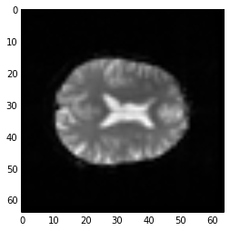

########################################################
Working with four dimensional images, with some revision
########################################################

Loading data with nibabel
-------------------------

First let's load a three-dimensional file, like the one we were looking at last week.

.. code:: python

    import nibabel as nib

First we ``load`` the image, to give an "image" object:

.. code:: python

    img = nib.load('ds107_sub001_highres.nii')

You can explore the returned image object with ``img.`` followed by TAB in the
IPython console.

Because images can have large arrays, nibabel does not load the image
array when you ``load`` the image, in order to save time and memory. The
best way to get the image array data is with the ``get_data()`` method.

.. code:: python

    data = img.get_data()
    type(data)

This gives:

.. parsed-literal::

    numpy.core.memmap.memmap

The ``memmap`` is a special type of array that saves memory, but
otherwise behaves the same as any normal array.

The data is a three dimensional array.  We can show slices from this data with matplotlib.

Four dimensional arrays - space + time
--------------------------------------

Images can also be four-dimensional.  It's easiest to think of four
dimensional images as a stack of 3-dimensional images (volumes).

Here we load a four dimensional image.  It is an functional MRI image, where
the volumes are collected in sequence a few seconds apart.

.. code:: python

    img = nib.load('ds114_sub009_t2r1.nii')
    data = img.get_data()

The image we have just loaded is a four-dimensional image, with
a four-dimensional array:

.. code:: python

    data.shape

.. parsed-literal::

    (64, 64, 30, 173)

The first three axes represent three dimensional space. The last axis
represents time. Here the last (time) axis has length 173. This means that,
for each of these 173 elements, there is one whole three dimensional image. We
often call the three-dimensional images *volumes*. So we could say that this
4D image contains 173 volumes.

We have previously been taking slices over the third axis of
a three-dimensional image. We can now take slices over the fourth axis of this
four-dimensional image:

.. code:: python

    first_vol = data[:, :, :, 0]  # A slice over the final (time) axis

This slice selects the first three-dimensional volume (3D image) from
the 4D array:

.. code:: python

    first_vol.shape

.. parsed-literal::

    (64, 64, 30)

You can use the ellipsis ``...`` when slicing an array. The ellipsis is
a short cut for "everything on the previous axes". For example, these
two have exactly the same meaning:

.. code:: python

    first_vol = data[:, :, :, 0]
    first_vol_again = data[..., 0]  # Using the ellipsis

``first_vol`` is a 3D image just like the 3D images you have already seen:

.. code:: python

    # A slice over the third dimension of a 3D image
    plt.imshow(first_vol[:, :, 14], cmap='gray')

Numpy operations work on the whole array by default
---------------------------------------------------

Numpy operations like ``min``, and ``max`` and ``std`` operate on the whole
numpy array by default, ignoring any array shape. For example, here is the
maximum value for the whole 4D array:

.. code:: python

    np.max(data)

.. parsed-literal::

    6793

This is exactly the same as:

.. code:: python

    # maximum when flattening the array to 1 dimension
    np.max(data.ravel())

You can ask numpy to operate over particular axes instead of operating over
the whole array. For example, this will generate a 3D image, where each array
value is the variance over the 173 values at that 3D position (the variance
across time):

.. code:: python

    # variance across the final (time) axis
    var_vol = np.var(data, axis=3)
    plt.imshow(var_vol[:, :, 14], cmap='gray')

Indexing with boolean arrays
----------------------------

We covered this briefly a few classes back.

Let's say we have an array like this:

.. code:: python

    arr = np.array([[0, 1, 3, 0], [5, 2, 0, 1]])

We can get a True / False (boolean) array to tell us whether these
values are above some threshold:

.. code:: python

    tf_array = arr > 2
    tf_array

.. parsed-literal::

    array([[False, False,  True, False],
           [ True, False, False, False]], dtype=bool)

You can flip the True / False values with ``~`` (bitwise not):

.. code:: python

    ~tf_array

.. parsed-literal::

    array([[ True,  True, False,  True],
           [False,  True,  True,  True]], dtype=bool)

We can use boolean arrays to *index* into the original array (or any array
with a suitable shape). This will select only the elements where the boolean
array is ``True``. The returned array may well have selected only a few
members from any particular row or column or (in general) higher axis, so the
returned array is always one-dimensional to reflect the loss of shape:

.. code:: python

    selected_elements = arr[tf_array]
    selected_elements

This gives:

.. parsed-literal::

    array([3, 5])

The returned array is shape ``(2,)`` (one-dimensional).

We can use this to select values in our image as well. For example, if we
wanted to select only values less than 10 in ``first_vol``:

.. code:: python

    tf_lt_10 = first_vol < 10
    vals_lt_10 = first_vol[tf_lt_10]
    np.unique(vals_lt_10)

This gives:

.. parsed-literal::

    array([0, 1, 2, 3, 4, 5, 6, 7, 8, 9], dtype=int16)
